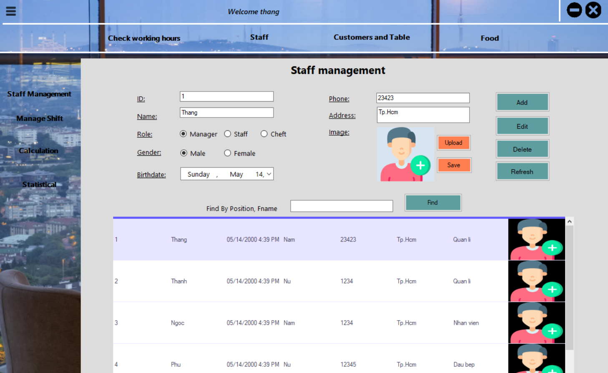
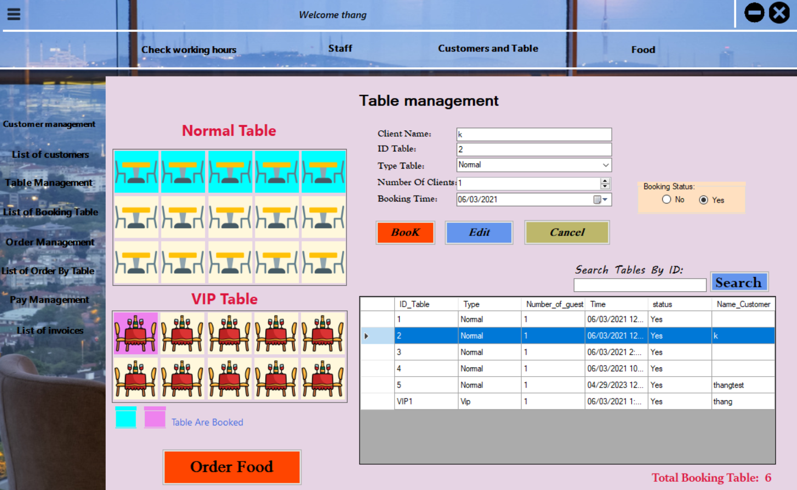
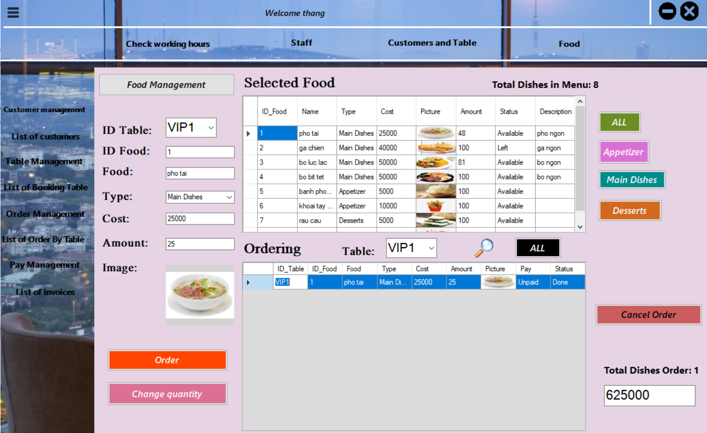

# Quản lí nhà hàng

**Đề tài**: Ứng dụng quản lí nhà hàng

**Công nghệ sử dụng**:

- BE: SQL Queries, Microsoft SQL Server
- FE: WinForms (C#)

**Thành Viên**: 2

## GIỚI THIỆU

- Ứng dụng này dùng để quản lí nhân viên nhà hàng (điểm danh, lương), quản lí nguyên liệu, thực phẩm và quản lí khách hàng (đặt bàn, đặt món và thanh toán hóa đơn).
  
  
  
## CÁCH CÀI ĐẶT

- Clone project

```
git clone https://github.com/ThangLe2209/Restaurant_Management.git
```

## DATABASE

1. Restore database trong Microsoft SQL Server bằng file QLHT.bak
2. Sửa SQL Connection trong file MY_DB.cs của thư mục sourcecode

```
SqlConnection con = new SqlConnection(@"Data Source=Your_Server_Name;Initial Catalog=Your_DB;User ID=Your_Account;Password=Your_Password;Connect Timeout=30;Encrypt=False;TrustServerCertificate=False;ApplicationIntent=ReadWrite;MultiSubnetFailover=False");
```
3. Cài đặt đã hoàn tất. Chạy ứng dụng để kiểm tra.
